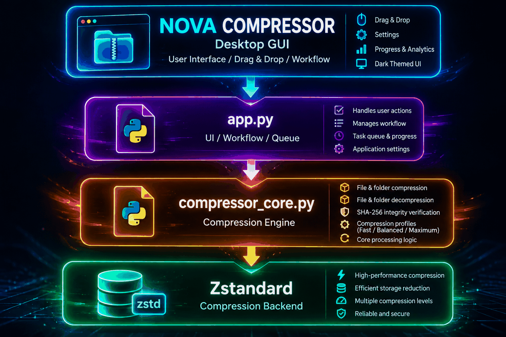
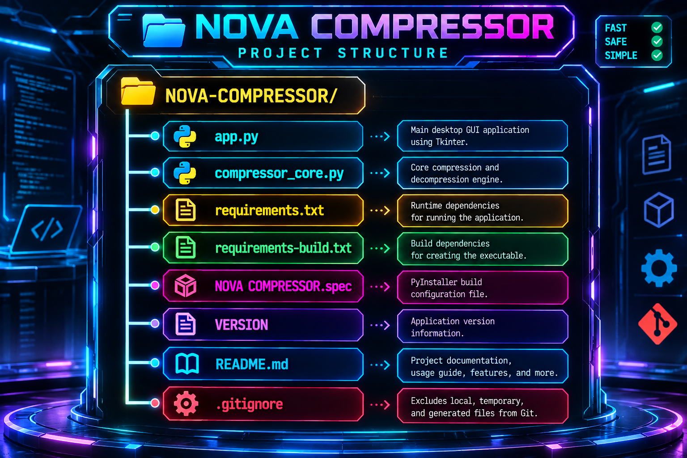

<div align="center">

  

  <h1>🚀 NOVA COMPRESSOR</h1>

  <h3>High-Performance Windows File & Folder Compression Utility</h3>

  <p>
    Fast • Smart • Secure • Powerful
  </p>

  <p>
    
    
    
    
    
    
  </p>

</div>

---

## 📖 Description / Overview

**NOVA COMPRESSOR** is a high-performance Windows desktop utility for compressing and decompressing files and folders using **Zstandard (Zstd)**.

It helps reduce storage usage while providing compression profiles, drag & drop workflows, progress tracking, and compression analytics.

Built with **Python, Tkinter, TkinterDnD2, and Zstandard**, it also provides **SHA-256 integrity verification** to validate compressed data.

---

## 📑 Table of Contents

- [📖 Description / Overview](#-description--overview)
- [✨ Features](#-features)
- [🛠️ Tech Stack / Requirements](#️-tech-stack--requirements)
- [📦 Installation / Setup](#-installation--setup)
- [▶️ Usage / How to Run](#️-usage--how-to-run)
- [📁 Project Structure](#-project-structure)
- [⚡ Compression Profiles](#-compression-profiles)
- [🔐 Integrity Verification](#-integrity-verification)
- [📊 Compression Analytics](#-compression-analytics)
- [🖱️ Drag & Drop](#️-drag--drop)
- [🏗️ Architecture](#️-architecture)
- [🧪 Development & Verification](#-development--verification)
- [🔨 Build](#-build)
- [🗺️ Roadmap](#️-roadmap)
- [🔒 Security](#-security)
- [🤝 Contributing](#-contributing)
- [📄 License](#-license)
- [👤 Author](#-author)
- [💬 Support](#-support)

---

## ✨ Features

- 📁 File compression and decompression
- 📦 Folder compression using `.tar.zst`
- ⚡ FAST, BALANCED, and MAXIMUM compression profiles
- 🖱️ Drag & drop support
- 📊 Real-time progress, speed, and ETA
- 📈 Compression analytics
- 🔐 SHA-256 integrity verification
- ❌ Compression cancellation support
- 🔄 Output conflict handling
- 📝 Recent operation history
- ⚙️ Persistent application settings
- 🌓 Dark-themed desktop interface
- ✅ Zstandard validation support
- 🖥️ Windows executable build support

---

## 🛠️ Tech Stack / Requirements

### 💻 Tech Stack

- **Language:** Python 3.14+
- **GUI:** Tkinter
- **Compression:** Zstandard 0.25.0
- **Drag & Drop:** TkinterDnD2 0.6.3
- **Integrity:** SHA-256
- **Executable Build:** PyInstaller 6.22.3
- **Platform:** Windows

### ⚙️ Requirements

- Windows operating system
- Python 3.14+ for running from source
- Zstandard 0.25.0
- TkinterDnD2 0.6.3
- PyInstaller 6.22.3 for building the executable

---

## 📦 Installation / Setup

### 1. Clone the Repository

```bash

git clone https://github.com/karnalking09/NOVA-COMPRESSOR.git
cd NOVA-COMPRESSOR

### 🪟 Windows

#### Create Virtual Environment

```powershell
python -m venv .venv
```

#### Activate Virtual Environment

```powershell
.\.venv\Scripts\Activate.ps1
```

#### Install Dependencies

```powershell
python -m pip install --upgrade pip
pip install -r requirements.txt
```

#### Run NOVA COMPRESSOR

```powershell
python app.py
```

---

### 🐧 Linux

#### Create Virtual Environment

```bash
python3 -m venv .venv
```

#### Activate Virtual Environment

```bash
source .venv/bin/activate
```

#### Install Dependencies

```bash
python3 -m pip install --upgrade pip
pip install -r requirements.txt
```

#### Run from Source

```bash
python3 app.py
```

> Linux support may require additional system packages for Tkinter and drag-and-drop functionality.

---

### 🍎 macOS

#### Create Virtual Environment

```bash
python3 -m venv .venv
```

#### Activate Virtual Environment

```bash
source .venv/bin/activate
```

#### Install Dependencies

```bash
python3 -m pip install --upgrade pip
pip install -r requirements.txt
```

#### Run from Source

```bash
python3 app.py
```

> macOS support may require additional system configuration for Tkinter and drag-and-drop functionality.>
 
## ▶️ Usage / How to Run

NOVA COMPRESSOR can be used either by running the Python source code or by using the packaged Windows executable.

### 🪟 Windows — Python Source

Activate the virtual environment:

```powershell
.\.venv\Scripts\Activate.ps1
```

Run the application:

```powershell
python app.py
```

The NOVA COMPRESSOR desktop interface will open.

### 🪟 Windows — Executable

After building the application, open:

```text
dist/NOVA COMPRESSOR/
```

Then launch:

```text
NOVA COMPRESSOR.exe
```

No Python command is required when using the packaged executable.

### 🐧 Linux — Python Source

Activate the virtual environment:

```bash
source .venv/bin/activate
```

Run:

```bash
python3 app.py
```

> Linux execution may require additional system packages for Tkinter and drag-and-drop support.

### 🍎 macOS — Python Source

Activate the virtual environment:

```bash
source .venv/bin/activate
```

Run:

```bash
python3 app.py
```

> macOS execution may require additional system configuration for Tkinter and drag-and-drop support.

---

## 📁 Basic Workflow

1. Launch **NOVA COMPRESSOR**.
2. Select a file or folder.
3. Select the desired compression profile.
4. Choose the output location.
5. Start compression.
6. Monitor progress, speed, and ETA.
7. Use **Validate Zstd** to verify compression integrity.
8. Decompress the generated archive when required.
9. Check the SHA-256 verification result.

---

## ⚡ Compression Profiles

NOVA COMPRESSOR provides three Zstandard compression profiles:

| Profile | Zstandard Level | Purpose |
|---|---:|---|
| ⚡ FAST | 1 | Faster compression with lower CPU usage |
| ⚖️ BALANCED | 5 | Balanced compression speed and size |
| 🏆 MAXIMUM | 19 | Higher compression with increased processing time |

### Profile Selection

```text
FAST
  ↓
Zstandard Level 1

BALANCED
  ↓
Zstandard Level 5

MAXIMUM
  ↓
Zstandard Level 19
```

---

## 🔐 Integrity Verification

NOVA COMPRESSOR uses **SHA-256** verification to help confirm that compressed data remains valid.

### Verification Workflow

```text
Compression
    ↓
Generate SHA-256
    ↓
Store Verification Data
    ↓
Validate Zstd
    ↓
Compare Hash
    ↓
PASS / FAIL
```

### Regular `.zst` Files

For regular `.zst` files, the SHA-256 hash is calculated from the **original uncompressed data** and used during validation.

### Folder `.tar.zst` Archives

For folder archives stored as `.tar.zst`, the verification data is based on the **compressed archive**.

### Validation Result

```text
PASS → Hash matches the stored verification data

FAIL → Hash does not match or required verification data is missing
```

Strict validation succeeds only when the expected SHA-256 value matches the calculated hash.

---

## 📊 Compression Analytics

After a compression operation, NOVA COMPRESSOR provides useful information such as:

| Metric | Description |
|---|---|
| Original Size | Size of the original input |
| Compressed Size | Size of the generated compressed output |
| Compression Ratio | Relationship between original and compressed size |
| Space Saved | Storage space reduced by compression |
| Processing Speed | Compression processing speed |
| Elapsed Time | Total processing duration |
| Verification Status | SHA-256 validation result |

---

## 🖱️ Drag & Drop

NOVA COMPRESSOR supports drag-and-drop workflows for adding files and folders directly to the application.

This provides a convenient way to:

- Add files
- Add folders
- Start compression workflows
- Process multiple inputs through the application interface

---

## 🏗️ Architecture

NOVA COMPRESSOR separates the desktop interface from the core compression engine.

<div align="center">



</div>

### Core Components

- **`app.py`** — desktop interface and application workflow
- **`compressor_core.py`** — compression and decompression engine
- **Zstandard** — compression backend
- **Tkinter / TkinterDnD2** — desktop GUI and drag-and-drop functionality
- **SHA-256** — integrity verification
---

## 🧪 Development & Verification

The project includes development checks for validating application behavior.

### Syntax Verification

```powershell
python -m py_compile app.py
```

### Dependency Installation

```powershell
pip install -r requirements.txt
```

### Build Dependency Installation

```powershell
pip install -r requirements-build.txt
```

### Executable Verification

The Windows executable can be generated with PyInstaller and tested independently from the Python source environment.

---

## 🔨 Build

### Install Build Dependencies

```powershell
pip install -r requirements-build.txt
```

### Build Windows Executable

```powershell
python -m PyInstaller --windowed --name "NOVA COMPRESSOR" app.py
```

The generated application will be available in:

```text
dist/NOVA COMPRESSOR/
```

The executable can be launched from:

```text
dist/NOVA COMPRESSOR/NOVA COMPRESSOR.exe
```

## 📁 Project Structure

<div align="center">



</div>

### 📌 File Overview

| File | Purpose |
|---|---|
| `app.py` | Main desktop GUI and application workflow |
| `compressor_core.py` | Core compression and decompression logic |
| `requirements.txt` | Runtime dependencies |
| `requirements-build.txt` | Build dependencies |
| `NOVA COMPRESSOR.spec` | PyInstaller build configuration |
| `VERSION` | Application version |
| `README.md` | Project documentation |
| `.gitignore` | Excludes local, temporary, and generated files |

---

## 🗺️ Roadmap

Future improvements may include:

- Additional compression formats
- Further UI improvements
- Additional performance optimizations
- Expanded cross-platform support
- Additional automated testing
- Improved release automation

---

## 🔒 Security

NOVA COMPRESSOR includes SHA-256 integrity verification for supported compression workflows.

Security-related project practices include:

- Integrity verification
- Validation of compressed data
- Avoiding generated local artifacts in version control
- Separation of source and build dependencies

If you discover a security issue, please report it responsibly.

---

## 🤝 Contributing

Contributions are welcome.

Before submitting changes:

1. Create a fork of the repository.
2. Create a feature branch.
3. Make your changes.
4. Test the changes locally.
5. Verify that the application starts correctly.
6. Submit a pull request with a clear description of the changes.

Please keep pull requests focused and avoid committing generated build artifacts or local test data.

---

## 📄 License

This project is intended to include a dedicated `LICENSE` file.

See the repository license file for the applicable licensing terms.

---

## 👤 Author

**Dev Kumar**

- GitHub: [@karnalking09](https://github.com/karnalking09)
- Project: [NOVA COMPRESSOR](https://github.com/karnalking09/NOVA-COMPRESSOR)

---

## 💬 Support

If you find an issue or have a suggestion:

- Open a GitHub Issue
- Provide clear reproduction steps
- Include relevant error messages
- Describe the expected and actual behavior

For project updates, follow the repository on GitHub.

---

<div align="center">

### 🚀 NOVA COMPRESSOR

**Compress • Verify • Manage**

</div>
🚀 NOVA COMPRESSOR

Compress • Verify • Manage
